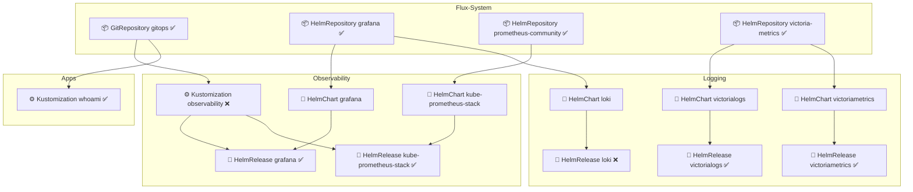

```mermaid
graph TD

  %% --- SOURCES ---
  subgraph Flux-System
    GitRepository_gitops["📦 GitRepository gitops ✅"]
    HelmRepository_grafana["📦 HelmRepository grafana ✅"]
    HelmRepository_prometheus["📦 HelmRepository prometheus-community ✅"]
    HelmRepository_victoria["📦 HelmRepository victoria-metrics ✅"]
  end

  %% --- OBSERVABILITY ---
  subgraph Observability
    Kustomization_observability["⚙️ Kustomization observability ❌"]
    HelmChart_observability_grafana["📑 HelmChart grafana"]
    HelmRelease_grafana["🚀 HelmRelease grafana ✅"]
    HelmChart_observability_kps["📑 HelmChart kube-prometheus-stack"]
    HelmRelease_kube_prometheus_stack["🚀 HelmRelease kube-prometheus-stack ✅"]
  end

  %% --- LOGGING ---
  subgraph Logging
    HelmChart_logging_loki["📑 HelmChart loki"]
    HelmRelease_loki["🚀 HelmRelease loki ❌"]
    HelmChart_logging_victorialogs["📑 HelmChart victorialogs"]
    HelmRelease_victorialogs["🚀 HelmRelease victorialogs ✅"]
    HelmChart_logging_victoriametrics["📑 HelmChart victoriametrics"]
    HelmRelease_victoriametrics["🚀 HelmRelease victoriametrics ✅"]
  end

  %% --- APPS ---
  subgraph Apps
    Kustomization_whoami["⚙️ Kustomization whoami ✅"]
  end

  %% --- EDGES ---
  GitRepository_gitops --> Kustomization_observability
  GitRepository_gitops --> Kustomization_whoami

  HelmRepository_grafana --> HelmChart_observability_grafana --> HelmRelease_grafana
  HelmRepository_prometheus --> HelmChart_observability_kps --> HelmRelease_kube_prometheus_stack
  HelmRepository_grafana --> HelmChart_logging_loki --> HelmRelease_loki
  HelmRepository_victoria --> HelmChart_logging_victorialogs --> HelmRelease_victorialogs
  HelmRepository_victoria --> HelmChart_logging_victoriametrics --> HelmRelease_victoriametrics

  Kustomization_observability --> HelmRelease_grafana
  Kustomization_observability --> HelmRelease_kube_prometheus_stack
```
